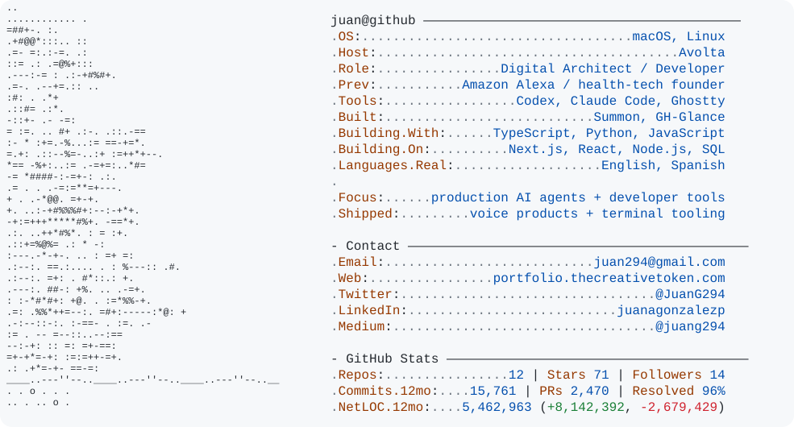

<picture>
  <source media="(prefers-color-scheme: dark)" srcset="./dark_mode.svg">
  
</picture>

---

## About

I try to move through life with awareness: of my surroundings, my privilege, how lucky I am, and how limited time really is. I don't take for granted who I am, what I have, or the people around me. That awareness shapes how I live. It keeps me honest about my purpose and my responsibility to others.

I don't save things for later, because later isn't promised. My family comes first, always. No job, no perk, no shiny new thing comes close. I've walked away from a lot and stepped into uncertainty more than once, because I'd rather be free than live by rules that betray what matters to me.

I have a strong sense of purpose, and I'm borderline delusional about what I might be able to achieve. I care deeply about doing meaningful work, doing it well, and not wasting time on things that don't matter to me or the people I love.

---

## Tech Stack

| | Currently building with |
|:--|:--|
| **Build** |      |
| **AI & agents** |     |
| **Platform** |      |

---

## Chapa

